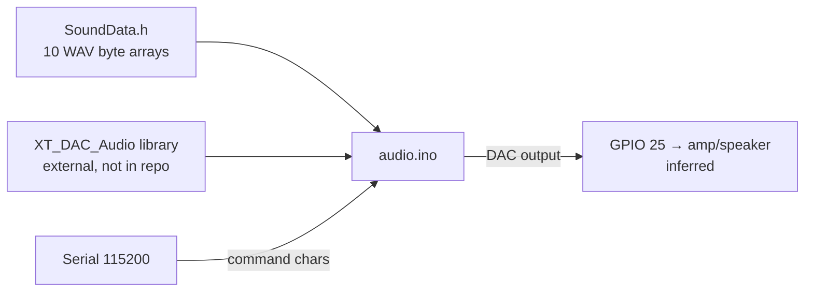

# Code Overview

This document explains the original source code **without modifying it**. Line references point to the files as they were originally written.

```
src/audio/
├── audio.ino     # Sketch: setup, main loop, serial command parser, playback
└── SoundData.h   # Ten 8 kHz / 8-bit / mono WAV files embedded as byte arrays
```

The folder is named `audio/` because the Arduino IDE requires a sketch's folder to have the same name as its `.ino` file.

## `audio.ino`

### External dependencies

| Include | Provided by | Status |
| --- | --- | --- |
| `SoundData.h` | This repository | Confirmed |
| `XT_DAC_Audio.h` | The third-party **XT_DAC_Audio** library (XTronical) | Confirmed by name; **not included** in the repository. The library version used is Unknown. |

Classes used from the library: `XT_DAC_Audio_Class`, `XT_Wav_Class`, `XT_Sequence_Class`.

### Global objects

| Object | Type | Purpose |
| --- | --- | --- |
| `DacAudio(25,0)` | `XT_DAC_Audio_Class` | Audio output engine on DAC pin **25**. The `0` is inferred to be the hardware timer index. |
| `bellsD`, `navidadD`, `faltanD`, `paraD`, `semanasD`, `unaD`, `dosD`, `tresD`, `cuatroD`, `cincoD` | `XT_Wav_Class` | One playable wrapper per embedded WAV array |
| `Sequence` | `XT_Sequence_Class` | A playlist that chains several clips into one utterance |

### Functions

| Function | Responsibility |
| --- | --- |
| `setup()` | Starts serial at **115200** baud. |
| `loop()` | Calls `DacAudio.FillBuffer()` on every pass to keep the DAC fed. When serial data is available, reads it as a string and passes it to `PlayNumber()`. |
| `PlayNumber(char const *Number)` | Clears the sequence, adds one clip per character of the input, starts playback, and echoes the received string back over serial. |
| `AddNumberToSequence(char TheNumber)` | Maps one command character to its clip with a `switch`. Unknown characters (including `\r` / `\n` line endings) are ignored because there is no `default` case. |

`PlayNumber` and `AddNumberToSequence` are defined after `loop()` without forward declarations. This compiles in the Arduino IDE because its preprocessor generates function prototypes automatically.

### Command protocol

Each character of a received serial string is one "token":

| Char | Clip | Spoken word (inferred) |
| --- | --- | --- |
| `b` | `bells_wav` | bell sound |
| `n` | `navidad_wav` | "Navidad" |
| `f` | `faltan_wav` | "Faltan" |
| `p` | `para_wav` | "para" |
| `s` | `semanas_wav` | "semanas" |
| `1` | `una_wav` | "una" |
| `2` | `dos_wav` | "dos" |
| `3` | `tres_wav` | "tres" |
| `4` | `cuatro_wav` | "cuatro" |
| `5` | `cinco_wav` | "cinco" |

Example (inferred usage): sending `bf3spn` would play *bells → "Faltan tres semanas para Navidad"*.

### Execution flow

```mermaid
sequenceDiagram
    participant Host as Serial host
    participant Loop as loop()
    participant PN as PlayNumber()
    participant Seq as XT_Sequence_Class
    participant DAC as XT_DAC_Audio (GPIO 25)

    loop every iteration
        Loop->>DAC: FillBuffer()
    end
    Host->>Loop: "f3spn"
    Loop->>PN: Serial.readString().c_str()
    PN->>Seq: RemoveAllPlayItems()
    loop for each char
        PN->>Seq: AddPlayItem(&clip)
    end
    PN->>DAC: Play(&Sequence)
    PN->>Host: Serial.println("f3spn")
```

## `SoundData.h`

A generated-looking header (hex arrays, 12 bytes per line) holding complete WAV files, RIFF header included. It was most likely produced by a WAV-to-C-array conversion tool (**Inferred**; the tool is Unknown). There are no include guards and no comments.

All clips share the same format, parsed from their headers: **PCM, 1 channel, 8,000 Hz, 8 bits per sample**.

| Array | Declared size (bytes) | Audio duration | `const` |
| --- | ---: | ---: | :---: |
| `navidad_wav` | 4,684 | 0.58 s | yes |
| `bells_wav` | 48,242 | 6.02 s | yes |
| `faltan_wav` | 11,033 | 1.37 s | yes |
| `para_wav` | 4,439 | 0.55 s | yes |
| `semanas_wav` | 8,591 | 1.07 s | yes |
| `tres_wav` | 3,951 | 0.49 s | yes |
| `dos_wav` | 3,463 | 0.43 s | yes |
| `una_wav` | 3,463 | 0.43 s | yes |
| `cuatro_wav` | 5,416 | 0.67 s | yes |
| `cinco_wav` | 6,271 | 0.78 s | **no** |
| **Total** | **99,553** | **≈12.4 s** | |

The source text of the header is about 620 KB, but the compiled audio data is about 97 KB.

## Relationships


